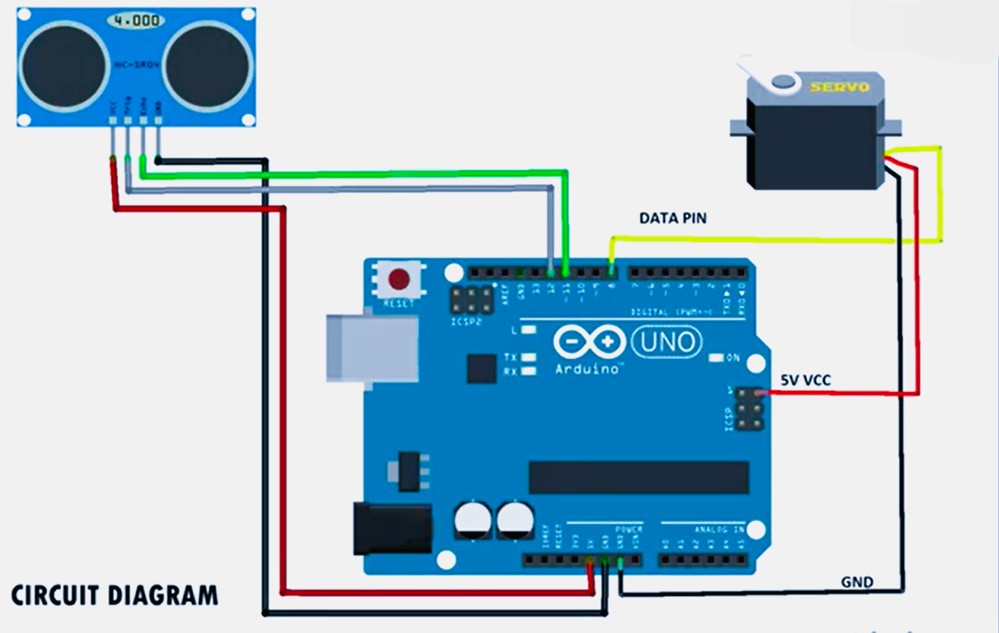

# Smart Dustbin using Arduino

## Overview
This is an automatic smart dustbin made using Arduino UNO and an ultrasonic sensor. The dustbin lid opens automatically when a hand comes near the sensor.

## Components Used
- Arduino UNO
- HC-SR04 Ultrasonic Sensor
- Servo Motor
- Jumper Wires
- USB Cable

## Features
- Automatic lid opening
- Touchless operation
- Simple and low-cost project

## Working
The ultrasonic sensor detects nearby objects. When a hand comes close, the servo motor rotates and opens the lid automatically.

## Project Image

## Project Demo Video

[Watch the Smart Dustbin Demo](https://github.com/Sauhard-Git/Smart-Dustbin-Arduino/blob/main/smartdustbin.mp4)

## Circuit diagram

## Author
Sauhard Agnihotri
